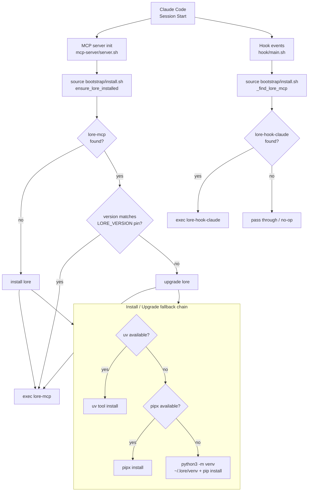

# Plugin Startup Flow

How the lore plugin initializes when a Claude Code session starts.

## Key points

- **MCP server** (`server.sh`) is the only place that installs or upgrades lore — it calls `ensure_lore_installed` before starting `lore-mcp`
- **Hook proxy** (`hook/main.sh`) only checks if `lore-hook-claude` exists — it does **not** install. If lore isn't installed yet, it silently passes through
- **Installer fallback**: `uv` > `pipx` > `python3 -m venv` (no external dependencies required)
- **Version pin**: `LORE_VERSION` file controls which lore version is installed. Upgrade only triggers when the pin changes (via plugin update)
