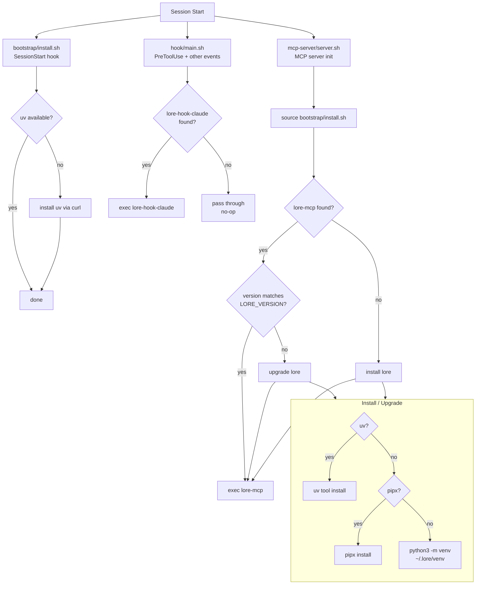

# Plugin Startup Flow

How the lore plugin initializes when a Claude Code session starts.

## Key points

- **MCP server** handles install/upgrade — it runs before `lore-mcp` starts, so no running process is replaced
- **Bootstrap hook** only ensures `uv` is present (lightweight)
- **Hook proxy** delegates if `lore-hook-claude` exists, otherwise silently passes through
- **Installer priority**: `uv` > `pipx` > `python3 venv`
